# 🏛️ Enterprise Workspace Topology & Directory Structure

This document defines the physical layout, package organization, and unidirectional dependency structures governing the **Nexus Enterprise** monorepo .

<p align="center">
  
</p>

---

## 🔄 Unidirectional Dependency & Boundary Invariants

The workspace is split into decoupled layers . Dependencies follow a strict, one-way inward trajectory . Changes made to outer layers have **zero ripple effects** on core internal structures :

- Altering the delivery code within `apps/` causes absolutely zero disruption to infrastructure, application, or domain boundaries .
- Application use-case refactoring maintains a strict zero-dependency footprint regarding the pure domain core .

### 🔀 Microservice Isolation & Event-Driven Autonomy

Runtime microservices are entirely isolated from one another, sharing no database instances or direct network couplings . Communication is orchestrated exclusively via **Apache Kafka** transaction logs .

- **The Outbox Decoupling Model:** Transaction state changes insert a job record into a local Outbox table . An autonomous database event-worker polls this log, marks the processing state (`processed_at`), and streams the transaction record directly to Kafka . Downstream target consumers handle the event asynchronously, making the microservices completely agnostic to each other's native language runtimes or infrastructure .

---

## 📁 Centralized Workspace Blueprints

### 1. Applications (`apps/`)

Exclusively contains standalone, deployable runtimes . Each gateway, microservice, or worker loop within [`apps/`](../../apps/) operates on an independent Docker image ecosystem .

- 📂 **Edge Gateway & API:** Exposes external HTTP/GraphQL routing capabilities .
- 📂 **Event Workers:** Autonomous background worker loops specialized in processing outbox records .

### 2. Internal Packages (`packages/`)

The reusable core of the monorepo consumed directly by our microservices and API runtimes .

- 📂 **Domain Core:** Framework-agnostic entity boundaries and contract ports .
- 📂 **Infrastructure Packages:** Explicit adapter implementations (`infra-kafka`, `infra-redis`) .

### 3. Pipeline & Automation Gates (`.github/` & `.husky/`)

- 📂 [`.github/workflows/`](../../.github/workflows/) — Automated continuous integration suites validating strict linting, unit tests, integration test configurations, and E2E testing matrices before blocking pull request merges .
- 📂 [`.husky/`](../../.husky/) — Local lifecycle Git hooks mirroring CI validation parameters inside the developer's local environment prior to committing code .

### 4. High-Observability Ecosystem (`monitoring/`)

- 📂 [`monitoring/`](../../monitoring/) — Infrastructure configurations spinning up the complete observability triad: **Grafana Tempo** (Distributed Tracing), **Prometheus** (Metrics), and **Grafana Loki** (Log Aggregation) to map end-to-end transaction contexts across Kafka brokers .

---

## ⚡ Turborepo Task Pipelines (`turbo.json`)

Task dependencies and caching strategies are defined globally within the root layout to leverage Directed Acyclic Graph (DAG) task scheduling and Remote Caching optimizations :

```json
{
  "$schema": "https://turbo.build",
  "pipeline": {
    "build": {
      "dependsOn": ["^build"],
      "outputs": ["dist/**", ".next/**"]
    },
    "lint": {},
    "test": {
      "dependsOn": ["^build"]
    }
  }
}
```

- 🔗 **Build Engine Configuration:** [`turbo.json`](../../turbo.json)
- `^build` — Enforces a strict order of operations, ensuring all internal dependencies within the workspace topology are fully compiled before the host service executes its own build pipeline .
