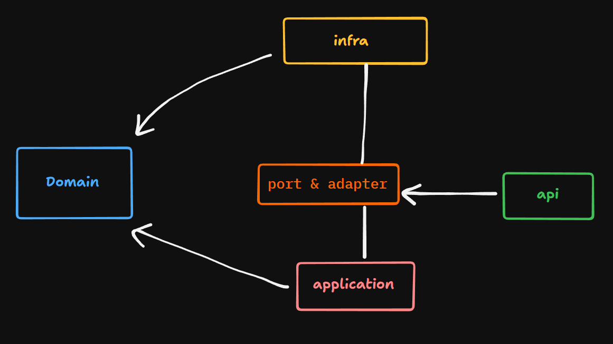
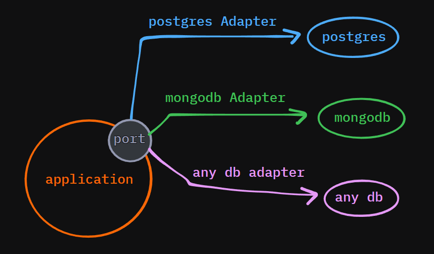
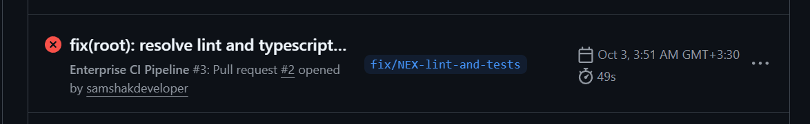
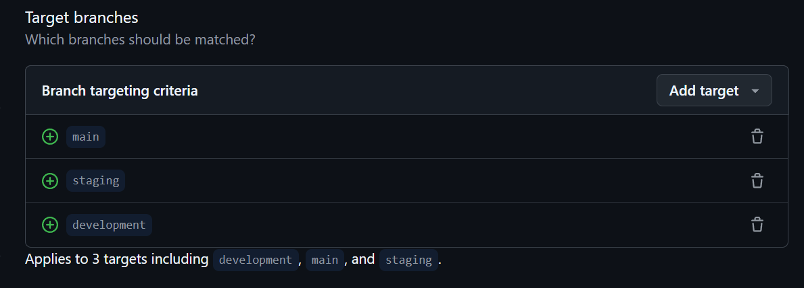

# Domain-Driven Design & Hexagonal Architecture Layers

This document explains how the architectural boundaries and layer separation in **Nexus Enterprise** are enforced in code.

<p align="center">
  
</p>

---

## Dependency Injection

The app wires all infrastructure adapters and application components together through an Inversion of Control (IoC) container.

- **Container directory:** [`apps/api/src/container/`](../../apps/api/src/container/)

For example, core infrastructure dependencies are registered as singletons using class bindings:

```typescript
userRepositoryPort: asClass(PostgresUserRepositoryAdapter).classic().singleton();
```

- **Composition root:** [`infrastructure.module.ts`](../../apps/api/src/container/modules/infrastructure.module.ts)

---

## Ports and Adapters

The application and infrastructure layers don't depend on each other directly. They talk through ports (boundary contracts).

So if you need to move from **PostgreSQL** to **MongoDB** (or any other storage), the application layer doesn't change. You only swap the infrastructure adapter, for example by registering a `MongodbUserRepositoryAdapter` instead of `PostgresUserRepositoryAdapter` in the container modules.

<p align="center">
  
</p>

<p align="center">
  
</p>

---

## Boundary Verification & Linting

To stop architectural drift and catch bad imports early, the layer rules are enforced with ESLint:

```json
"boundaries/element-types": [
  "error",
  {
    "default": "disallow",
    "rules": [
      { "from": "domain", "allow": ["shared"] },
      { "from": "application", "allow": ["domain", "shared"] },
      { "from": "infrastructure", "allow": ["application", "domain", "shared"] },
      { "from": "shared", "allow": [] },
      { "from": "app", "allow": ["infrastructure", "application", "domain", "shared"] }
    ]
  }
]
```

- **ESLint config:** [`eslint.config.js`](../../eslint.config.js)

With these rules, any import that breaks the dependency direction (for example, a service in `application` importing from `infrastructure`) is reported as a lint error in the developer's IDE.

---

## CI/CD Enforcement & Branch Protection

These boundaries don't depend on manual review of pull requests. They are checked automatically in CI.

<p align="center">
  
</p>

The pipeline runs lint:

```yaml
run: npm run lint --if-present
```

- **GitHub Action workflow:** [`ci-feature.yml`](../../.github/workflows/ci-feature.yml)

If an invalid import gets in, the workflow fails. Branch protection rules block merging a pull request until all checks pass.

<p align="center">
  
  <br />
  
  <br />
  
</p>

---

_More on testing, mocks and integration coverage is in the technical runbooks._