# 🏛️ CQRS & Asynchronous Event-Driven Architecture

This document describes the event-driven topology, message orchestration lifecycle, and transactional outbox patterns implemented within **Nexus Enterprise** to guarantee eventual consistency across microservices .

<p align="center">
  
</p>

---

## ⚡ Asynchronous Architecture Design

To achieve deep service decoupling and high resilience, all core mutating command side-effects are decoupled using the **Transactional Outbox Pattern** alongside **Apache Kafka** transaction logs .

### 🛡️ Crash Resilience and Eventual Consistency
If a downstream messaging adapter (e.g., the notification or email worker engine) crashes, the global system transactional state remains completely unhindered . The atomic state change is locally guarded inside the source outbox log . Upon recovery, consumer loops automatically resubscribe from their last committed transaction offsets, processing pending jobs with zero message loss .

---

## 🔀 Step-by-Step Message Lifecycle & Code Mapping

### Step 1: Transactional Outbox Staging
Domain aggregate events are pulled and tracked into the outbox system repository atomically inside the initial core database transaction block .

```typescript
await this.deps.eventPublisherPort.publish(userAggregate.pullDomainEvents());
```

* 🔗 **Command Handler:** [`create-user.handler.ts`](../../packages/application/src/users/commands/create-user/create-user.handler.ts)

### Step 2: Batch Querying Unprocessed Logs
The isolated database background worker engine polls for untracked transaction mutations (`processed_at IS NULL`) up to defined structural limits .

```typescript
async fetchPendingMessages(batchSize: number): Promise<OutboxMessage[]> {
  const query = sql<OutboxMessage>`
    SELECT id,
           aggregate_id AS "aggregateId",
           event_name AS "type",
           payload,
           trace_id AS "traceId" 
    FROM outbox
    WHERE processed_at IS NULL
    LIMIT ${batchSize}
  `;
  // execution...
}
```

* 🔗 **Outbox Infrastructure Adapter:** [`outbox-repository.adapter.ts`](../../apps/event-worker/src/adapters/outbox-repository.adapter.ts)

### Step 3: Reliable Kafka Broker Dispatch & Acknowledgment
For every targeted uncommitted entry, the worker wraps payloads within cloud-event tracking schemas, dispatches messages to dedicated stream channels, and flags execution stamps safely .

```typescript
const pendingMessages = await this.outboxRepo.fetchPendingMessages(50);

for (const message of pendingMessages) {
  try {
    const topic = DomainEventTopics.USER_EVENTS; 
    const eventEnvelope: DomainEventEnvelope = {
      eventId: message.id,
      type: message.type,
      data: message.payload, 
      traceId: message.traceId ?? crypto.randomUUID(),
    };
    await this.messageBrokerPublisher.publish(topic, message.aggregateId, eventEnvelope, message.traceId);
    await this.outboxRepo.markAsProcessed(message.id);
  } catch (error) { 
    // Operational failure tracking...
  }
}
```

### Step 4: Stream Channel Subscription
Target asynchronous isolated execution nodes (e.g., `email-worker`) subscribe natively to the message streams without any internal direct workspace dependencies .

```typescript
await consumer.subscribe({ topic: DomainEventTopics.USER_EVENTS, fromBeginning: false });
```

* 🔗 **Consumer Entrypoint:** [`email-worker.ts`](../../apps/email-worker/src/email-worker.ts)

### Step 5: Isolated Worker Delivery Execution
Messages are passed directly to targeted pipeline handlers with manual commit cycles enabled, preserving strict data acknowledgment safety gates .

```typescript
await consumer.run({
  autoCommit: false,
  eachMessage: (payload) => workerHandler.handleMessage(payload),
});
```

* 🔗 **Consumer Execution Handler:** [`email-worker.handler.ts`](../../apps/email-worker/src/handlers/email-worker.handler.ts)
