# Observability & Telemetry Architecture

This document describes how telemetry is collected, how traces are propagated, and what monitoring setup runs alongside **Nexus Enterprise**.

<p align="center">
  
</p>

---

## Traces, Metrics and Logs

The telemetry layer covers the three pillars of observability: **traces, metrics and logs**. Traces and metrics are exported asynchronously from the services over **OpenTelemetry (OTLP)**. Logs are sent to Loki. Everything is viewed in **Grafana**.

---

## Implementation

### Step 1: Bootstrapping the OpenTelemetry SDK

Telemetry is driven by an OpenTelemetry NodeSDK instance. It sets shared attributes (service name and version), exports metrics on a fixed interval, and instruments the Node process automatically.

```typescript
const sdk = new NodeSDK({
  resource: resourceFromAttributes({
    [ATTR_SERVICE_NAME]: serviceName,
    [ATTR_SERVICE_VERSION]: "1.0.0",
  }),
  traceExporter: new OTLPTraceExporter({ url: `${otlpEndpoint}/v1/traces` }),
  metricReader: new PeriodicExportingMetricReader({
    exporter: new OTLPMetricExporter({ url: `${otlpEndpoint}/v1/metrics` }),
    exportIntervalMillis: 15_000,
  }),
  instrumentations: [getNodeAutoInstrumentations()],
});
```

- **Telemetry bootstrap:** [`tracing.ts`](../../apps/api/src/telemetry/tracing.ts)

### Step 2: Tracing the command bus with a decorator

Tracing spans are added around the command bus by a `TracedCommandBusAdapter` decorator, which is registered in the IoC container.

```typescript
commandBus: asFunction(({ loggerPort }: CompositionRootContract) => {
  const bus = new InMemoryCommandBus();
  return new TracedCommandBusAdapter(bus, loggerPort, env.TRACING_LEVEL);
}).singleton();
```

- **Container module:** [`infrastructure.module.ts`](../../apps/api/src/container/modules/infrastructure.module.ts)

---

## Controlling Overhead

To keep memory and network usage under control when traffic is high, the level of detail is set with the `env.TRACING_LEVEL` environment variable:

- **Detailed:** logs more of the internal lifecycle. Useful when debugging a specific problem.
- **Low-overhead (production baseline):** logs only the minimum, which keeps CPU and network usage low.
